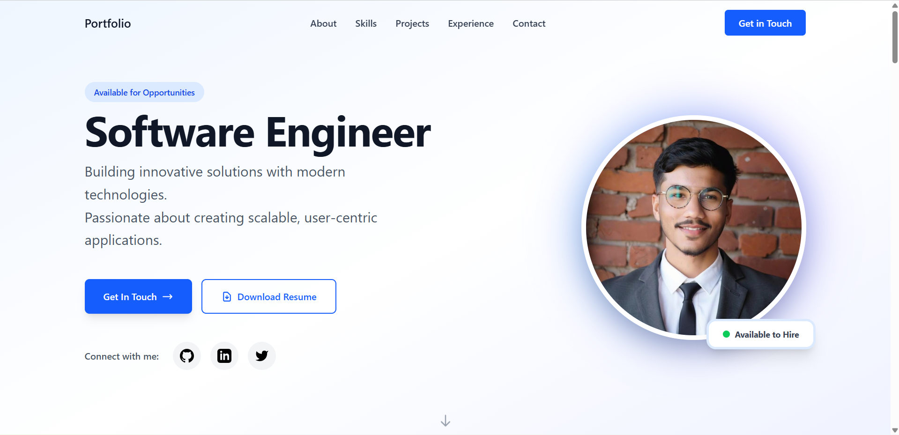
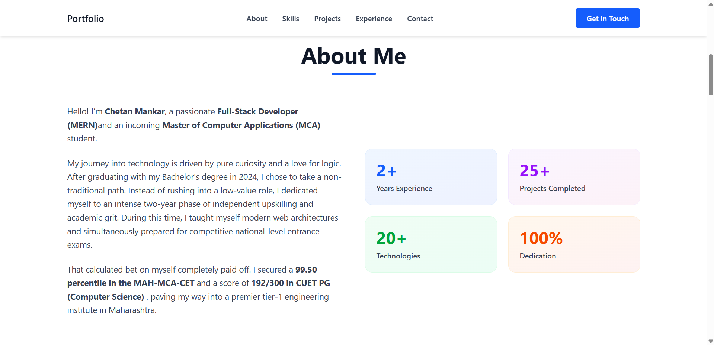
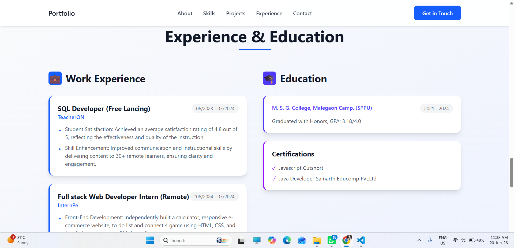
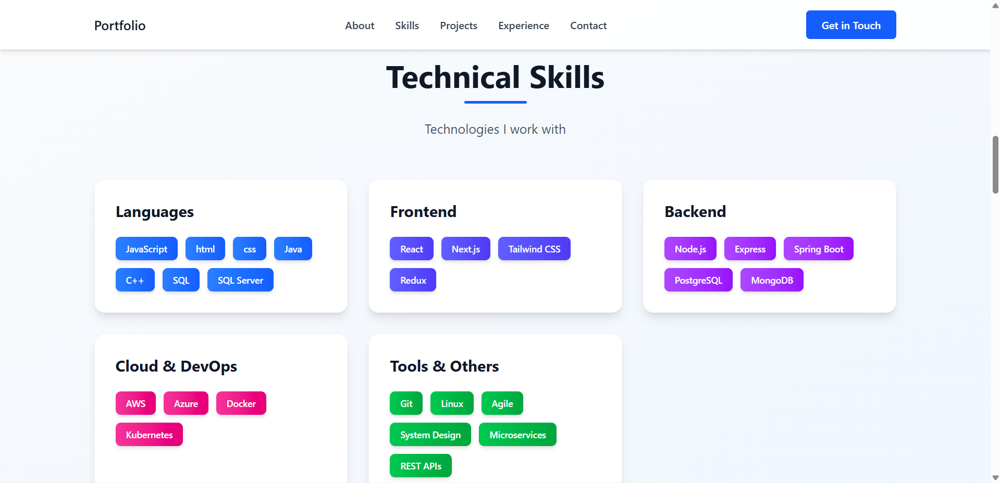
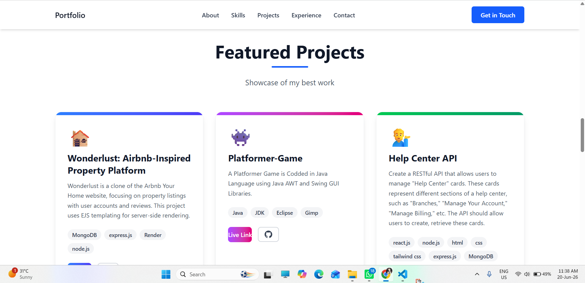
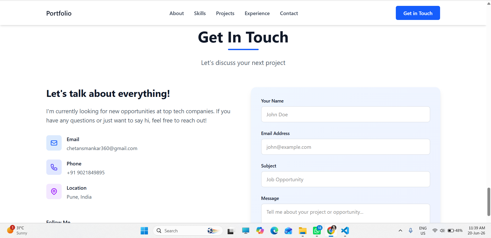

# Portfolio Website - Software Engineer

A modern, interactive portfolio website designed for targeting FANG/MANG SDE roles, featuring a Microsoft-inspired design aesthetic.

## ✨ Features

- **Clean & Professional Design** - Microsoft Fluent Design System inspired interface
- **Smooth Animations** - Subtle transitions and hover effects throughout
- **Fully Responsive** - Optimized for all device sizes
- **Interactive Components** - Engaging user experience with smooth scrolling
- **Modern Tech Stack** - Built with React, TypeScript, and Tailwind CSS

## 🎨 Sections

1. **Hero** - Eye-catching introduction with social links
2. **About** - Personal introduction with key statistics
3. **Skills** - Categorized technical skills with color-coded tags
4. **Projects** - Showcase of 6 featured projects with descriptions
5. **Experience** - Work history, education, and certifications
6. **Contact** - Contact form and information

## 🛠️ Tech Stack

- **React 18** - Modern UI library
- **TypeScript** - Type-safe development
- **Vite** - Fast build tool
- **Tailwind CSS** - Utility-first styling
- **CSS Animations** - Smooth transitions and effects

## 🎯 Customization

To personalize this portfolio for your use:

1. **Add Your Profile Picture & Resume**:
   - Replace the placeholder with your profile picture:
     - Add your image file to the `public` folder (e.g., `public/profile.jpeg`)
     - In `src/components/Hero.tsx`, uncomment the `` tag and update the `src` attribute
     - Comment out or remove the SVG placeholder icon
   - Replace `public/resume.pdf` with your actual resume PDF file
   - The "Download Resume" button will automatically download your resume

2. **Update Personal Information**:
   - Edit contact details in `src/components/Contact.tsx`
   - Update social media links in `src/components/Hero.tsx` and `src/components/Contact.tsx`

3. **Modify Projects**:
   - Edit the `projects` array in `src/components/Projects.tsx`
   - Add your own project details, technologies, and descriptions

4. **Update Experience**:
   - Modify the `experiences` and `education` arrays in `src/components/Experience.tsx`
   - Add your work history and educational background

5. **Customize Skills**:
   - Edit the `skillCategories` array in `src/components/Skills.tsx`
   - Add or remove technologies based on your expertise

6. **About Section**:
   - Update your personal bio in `src/components/About.tsx`
   - Modify the statistics to reflect your achievements

## 🚀 Getting Started

```bash
# Install dependencies
npm install

# Run development server
npm run dev

# Build for production
npm run build
```

## 🎨 Design Philosophy

This portfolio follows Microsoft's design principles:

- **Clarity** - Clean, minimal interface with clear hierarchy
- **Confidence** - Bold typography and confident use of color
- **Fluidity** - Smooth animations and transitions
- **Depth** - Layered design with shadows and elevation

## 📱 Responsive Design

The portfolio is fully responsive and optimized for:

- Desktop (1920px+)
- Laptop (1280px - 1920px)
- Tablet (768px - 1280px)
- Mobile (320px - 768px)

## 🎯 Target Audience

Designed specifically for:

- FANG (Facebook/Meta, Amazon, Netflix, Google)
- MANG (Microsoft, Apple, Netflix, Google)
- Top-tier tech company recruitment

## Project Screenshots 🖼️

### 01. Hero Section



### 02. About Me



### 03. Experience & Education



### 04. Technical Skills



### 05. Featured Projects



### 06. Experience & Education


### 07. Get In Touch



---

## 📝 License

Feel free to use this template for your own portfolio. Customize it to match your personal brand!

---

**Built with ❤️ using React, TypeScript, and Tailwind CSS**
